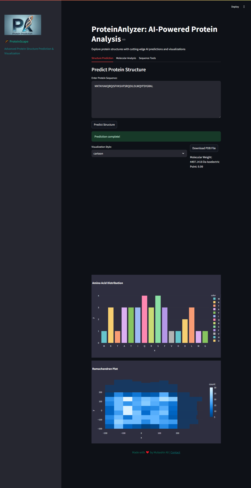
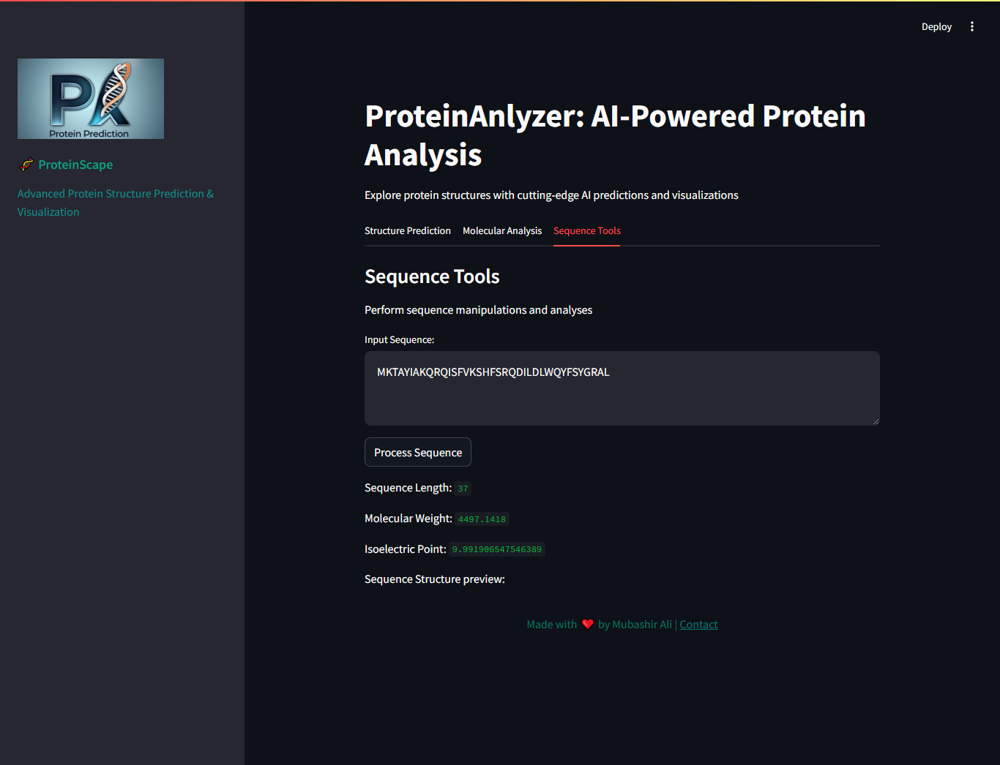

# ProteinScape: AI-Powered Protein Analysis


## 🚀 Overview
**ProteinScape** is an advanced AI-powered tool for **protein structure prediction, molecular analysis, and sequence visualization**. It leverages cutting-edge **bioinformatics, deep learning, and interactive visualizations** to provide insights into protein sequences and structures.

## 🎯 Features
- 🔬 **Protein Structure Prediction** using AI models
- 🏗 **3D Visualization** with Py3Dmol
- ⚖ **Molecular Weight & Isoelectric Point Calculation**
- 📊 **Amino Acid Distribution Analysis**
- 📉 **Ramachandran Plot for Structure Validation**
- 🛠 **Sequence Analysis & Manipulation Tools**

## 🖥️ Screenshots

### 🔬 Structure Prediction


### 📊 Amino Acid Distribution


### 🏗 3D Protein Visualization


## 🛠 Installation
Ensure you have **Python 3.8+** and install the required dependencies:

```bash
pip install -r requirements.txt
```

## 🚀 Usage
Run the Streamlit app using:

```bash
streamlit run app.py
```

## 📚 Dependencies
- `streamlit`
- `py3Dmol`
- `requests`
- `matplotlib`
- `seaborn`
- `plotly`
- `biopython`
- `rdkit`

## 💡 How It Works
1. **Enter a protein sequence**
2. **Predict its 3D structure** using AI
3. **Analyze molecular properties**
4. **Visualize amino acid distribution & Ramachandran plot**

## 🤝 Contributing
Feel free to **fork** this repository, submit issues, or create **pull requests**!

## 📧 Contact
Developed by **Mubashir Ali** | 📩 [Email](mailto:mubashirali1837@gmail.com)

---
_"Bringing AI & Bioinformatics Together!"_ 🧬

